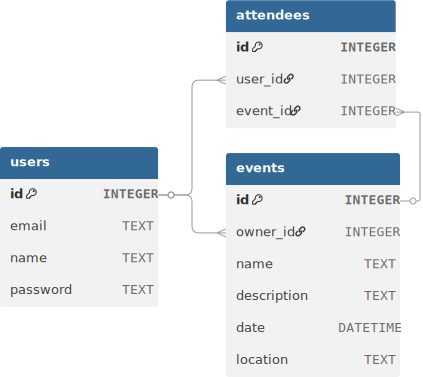

# Event API

Simple REST API untuk mengelola event dan attendees yang dibangun menggunakan Go, Gin framework, dan PostgreSQL database.

**Demo Swagger**: https://cold-mari-rizky-ardiansah-1181f7a4.koyeb.app/swagger/

## Features

- 🔐 **Authentication**: JWT-based authentication
- 📅 **Event Management**: Create, read, update, delete events
- 👥 **Attendee Management**: Add/remove attendees to/from events
- 📖 **API Documentation**: Swagger/OpenAPI documentation
- 🗄️ **Database**: PostgreSQL database dengan migrations

## Tech Stack

- **Language**: Go
- **Framework**: Gin (HTTP web framework)
- **Database**: PostgreSQL
- **Authentication**: JWT (golang-jwt)
- **Password Hashing**: bcrypt
- **Documentation**: Swagger (swaggo)
- **Live Reload**: Air (development)

## Getting Started

### Installation

1. Clone repository:

```bash
git clone https://github.com/rizky-ardiansah/event-api.git
cd event-api
```

2. Install dependencies:

```bash
go mod download
```

3. Buat file `.env`:

```bash
PORT=8080
JWT_SECRET=your-secret-key-here
```

4. Run migrations:

```bash
go run ./cmd/migrate
```

5. Run the application:

```bash
go run ./cmd/api
```

Server akan berjalan di `http://localhost:8080`

### Development dengan Air (Live Reload)

Install Air:

```bash
go install github.com/cosmtrek/air@latest
```

Jalankan dengan Air:

```bash
air
```

## API Endpoints

### Authentication

- `POST /api/v1/auth/register` - Register user baru
- `POST /api/v1/auth/login` - Login user

### Events (Public)

- `GET /api/v1/events` - Get semua events
- `GET /api/v1/events/{id}` - Get event by ID
- `GET /api/v1/events/{id}/attendees` - Get attendees untuk event
- `GET /api/v1/attendees/{id}/events` - Get events yang diikuti user

### Events (Authenticated - Bearer Token Required)

- `POST /api/v1/events` - Create event baru
- `PUT /api/v1/events/{id}` - Update event (owner only)
- `DELETE /api/v1/events/{id}` - Delete event (owner only)
- `POST /api/v1/events/{id}/attendees/{userId}` - Add attendee (owner only)
- `DELETE /api/v1/events/{id}/attendees/{userId}` - Remove attendee (owner only)

## API Documentation

Akses Swagger UI documentation di:

```
http://localhost:8080/swagger/index.html
```

## Project Structure

```
event-api/
├── cmd/
│   ├── api/           # Main application
│   └── migrate/       # Database migrations
├── internal/
│   ├── database/      # Database models dan operations
│   └── env/          # Environment configuration
├── docs/             # Swagger documentation
├── tmp/              # Air build files
├── .air.toml         # Air configuration
├── data.db           # SQLite database
└── README.md
```

## Database Schema



## Example Usage

### 1. Register User

```bash
curl -X POST http://localhost:8080/api/v1/auth/register \
  -H "Content-Type: application/json" \
  -d '{
    "email": "user@example.com",
    "password": "password123",
    "name": "John Doe"
  }'
```

### 2. Login

```bash
curl -X POST http://localhost:8080/api/v1/auth/login \
  -H "Content-Type: application/json" \
  -d '{
    "email": "user@example.com",
    "password": "password123"
  }'
```

### 3. Create Event (dengan Bearer Token)

```bash
curl -X POST http://localhost:8080/api/v1/events \
  -H "Content-Type: application/json" \
  -H "Authorization: Bearer YOUR_JWT_TOKEN" \
  -d '{
    "name": "Tech Meetup",
    "description": "Monthly tech meetup",
    "location": "Jakarta",
    "date": "2025-08-15"
  }'
```
